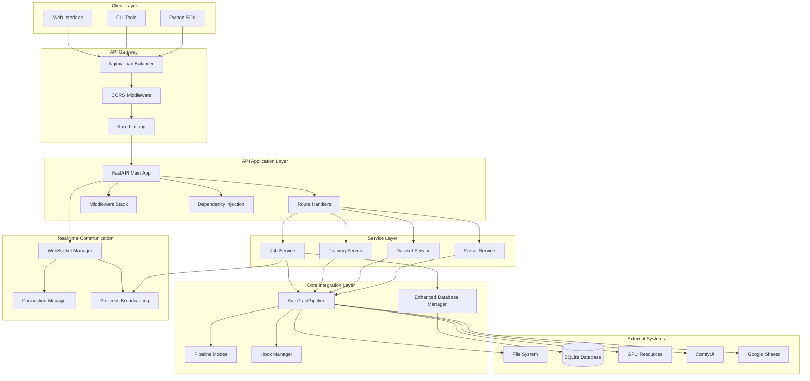
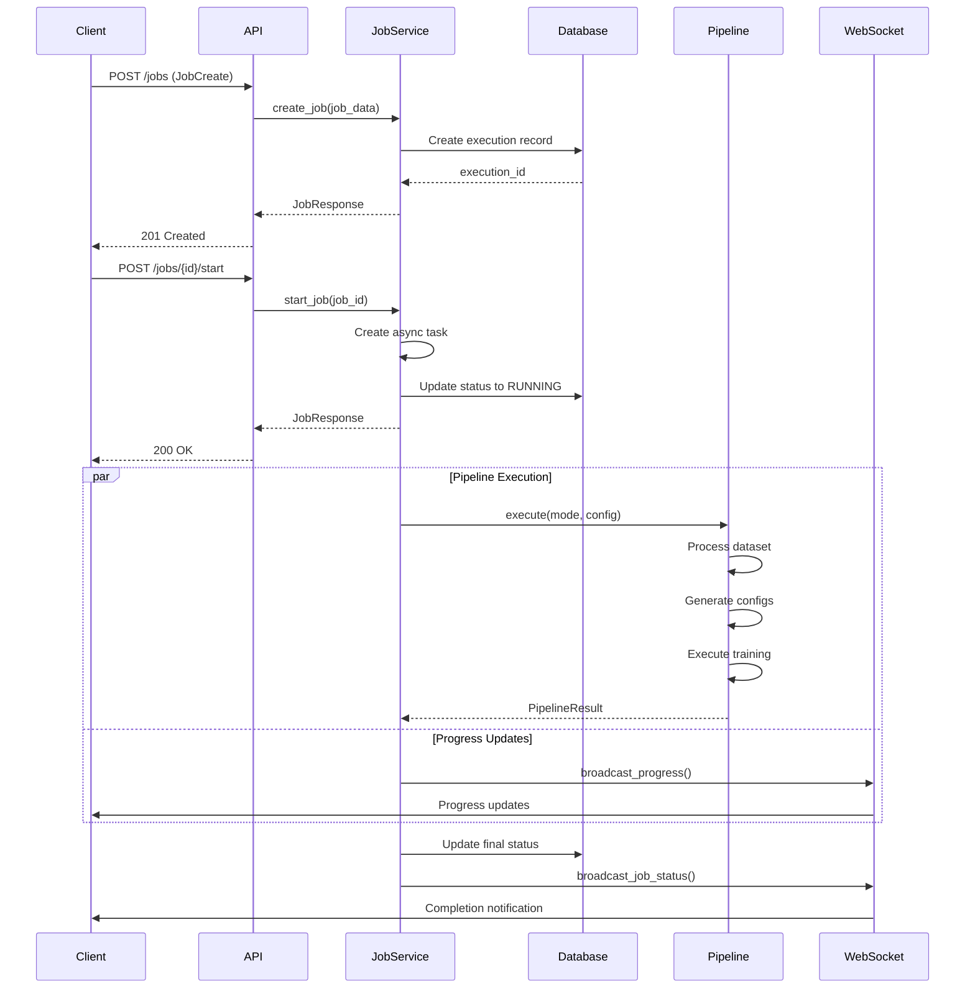
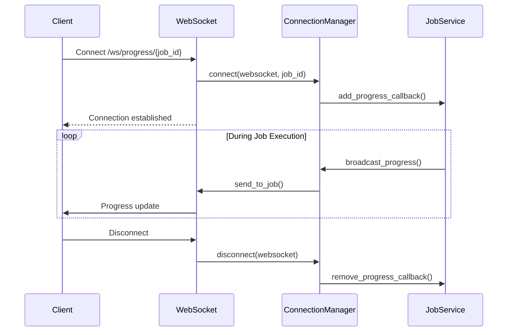
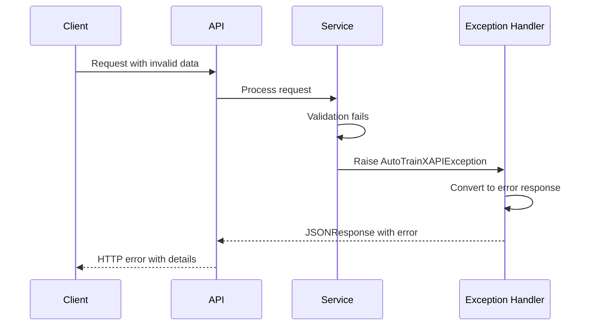

# AutoTrainX API Architecture Documentation

## Table of Contents

1. [Overview](#overview)
2. [System Architecture](#system-architecture)
3. [API Design Patterns](#api-design-patterns)
4. [Integration Points](#integration-points)
5. [Scalability Considerations](#scalability-considerations)
6. [Security Architecture](#security-architecture)
7. [Deployment Architecture](#deployment-architecture)
8. [Component Details](#component-details)
9. [Data Flow](#data-flow)
10. [Monitoring and Observability](#monitoring-and-observability)

## Overview

The AutoTrainX API backend is a comprehensive RESTful API built on FastAPI that provides programmatic access to the AutoTrainX machine learning training pipeline. The API maintains strict separation from the original codebase, implementing a clean service layer architecture that integrates seamlessly with existing components while adding modern API capabilities including real-time WebSocket communication, comprehensive error handling, and scalable job management.

### Key Features
- **RESTful Design**: Full REST compliance with proper HTTP methods and status codes
- **Real-time Communication**: WebSocket-based progress monitoring and notifications
- **Asynchronous Processing**: Non-blocking job execution with background task management
- **Comprehensive Error Handling**: Structured exception hierarchy with detailed error responses
- **Modular Architecture**: Clean separation of concerns with dependency injection
- **Database Integration**: Seamless integration with existing SQLAlchemy-based data layer
- **Multi-mode Support**: Support for single, batch, and variations training modes

## System Architecture

### High-Level Architecture



### Architectural Layers

#### 1. API Application Layer
- **FastAPI Application**: Main application instance with lifespan management
- **Route Handlers**: RESTful endpoints organized by domain (jobs, training, datasets, presets)
- **Middleware Stack**: CORS, trusted hosts, exception handling, request validation
- **Dependency Injection**: Service discovery and dependency management

#### 2. Service Layer
- **JobService**: Business logic for job lifecycle management
- **Training Services**: Specialized services for different training modes
- **Dataset Services**: Dataset management and preparation operations
- **Preset Services**: Configuration and preset management

#### 3. Integration Layer
- **Core Components**: Direct integration with existing AutoTrainPipeline
- **Database Layer**: Enhanced database manager with connection pooling
- **Hook System**: Extensible pipeline hooks for image preview and other operations

#### 4. Communication Layer
- **WebSocket Management**: Real-time progress monitoring and notifications
- **Connection Management**: Client connection lifecycle and broadcasting
- **Progress System**: Standardized progress reporting across all operations

## API Design Patterns

### 1. RESTful Design Principles

The API follows REST architectural constraints:

#### Resource-Based URLs
```
/api/v1/jobs              # Job collection
/api/v1/jobs/{job_id}     # Specific job resource
/api/v1/training/single   # Training operations
/api/v1/datasets          # Dataset collection
/api/v1/presets           # Preset collection
```

#### HTTP Method Semantics
- **GET**: Retrieve resources (idempotent)
- **POST**: Create new resources or trigger operations
- **PUT**: Update entire resources (idempotent)
- **PATCH**: Partial resource updates
- **DELETE**: Remove resources (idempotent)

#### Status Code Usage
- **200 OK**: Successful GET/PUT operations
- **201 Created**: Successful resource creation
- **202 Accepted**: Asynchronous operation started
- **204 No Content**: Successful DELETE operations
- **400 Bad Request**: Client error with invalid request
- **404 Not Found**: Resource not found
- **409 Conflict**: Resource state conflict
- **422 Unprocessable Entity**: Validation errors
- **500 Internal Server Error**: Server errors

### 2. Service Layer Pattern

```python
class JobService:
    """Business logic layer for job management."""
    
    def __init__(self, db_manager: EnhancedDatabaseManager, pipeline: AutoTrainPipeline):
        self.db_manager = db_manager
        self.pipeline = pipeline
        self._running_jobs: Dict[str, asyncio.Task] = {}
        self._progress_callbacks: Dict[str, List[callable]] = {}
    
    async def create_job(self, job_data: JobCreate) -> JobResponse:
        """Create new job with validation and persistence."""
        # Business logic implementation
        pass
```

**Benefits:**
- **Separation of Concerns**: Business logic isolated from HTTP concerns
- **Testability**: Services can be unit tested independently
- **Reusability**: Services can be used by different interfaces
- **Maintainability**: Clear boundaries and responsibilities

### 3. Dependency Injection Pattern

```python
@lru_cache()
def get_database_manager() -> EnhancedDatabaseManager:
    """Singleton database manager instance."""
    return EnhancedDatabaseManager(enable_monitoring=True)

def get_job_service(
    db_manager: EnhancedDatabaseManager = Depends(get_database_manager),
    pipeline: AutoTrainPipeline = Depends(get_pipeline_service)
) -> JobService:
    """Inject dependencies into JobService."""
    return JobService(db_manager=db_manager, pipeline=pipeline)
```

**Benefits:**
- **Loose Coupling**: Components depend on abstractions
- **Testing**: Easy mocking and dependency substitution
- **Configuration**: Centralized dependency configuration
- **Lifecycle Management**: Singleton and scoped instances

### 4. Exception Handling Pattern

```python
class AutoTrainXAPIException(Exception):
    """Base exception with structured error information."""
    
    def __init__(self, message: str, status_code: int, error_code: str, details: dict):
        self.message = message
        self.status_code = status_code
        self.error_code = error_code
        self.details = details

@app.exception_handler(AutoTrainXAPIException)
async def handle_api_exception(request: Request, exc: AutoTrainXAPIException):
    """Convert exceptions to structured error responses."""
    return JSONResponse(
        status_code=exc.status_code,
        content=create_error_response(exc.error_code, exc.message, exc.details)
    )
```

**Benefits:**
- **Consistency**: Uniform error response format
- **Debugging**: Detailed error information and context
- **Client-Friendly**: Machine-readable error codes
- **Monitoring**: Structured error logging and tracking

### 5. WebSocket Integration Pattern

```python
class ConnectionManager:
    """Manages WebSocket connections and broadcasting."""
    
    def __init__(self):
        self.job_connections: Dict[str, Set[WebSocket]] = {}
        self.global_connections: Set[WebSocket] = set()
    
    async def broadcast_progress(self, progress_update: ProgressUpdate):
        """Broadcast progress to relevant connections."""
        message = {"type": "progress_update", "data": progress_update.dict()}
        await self.send_to_job(progress_update.job_id, message)
        await self.send_to_all(message)
```

**Benefits:**
- **Real-time Communication**: Immediate progress updates
- **Selective Broadcasting**: Target specific clients or broadcast globally
- **Connection Management**: Automatic cleanup and error handling
- **Scalability**: Supports multiple concurrent connections

## Integration Points

### 1. AutoTrainPipeline Integration

The API integrates with the existing AutoTrainPipeline through a clean service layer:

```python
class JobService:
    async def _run_pipeline_async(self, mode: PipelineMode, config: dict) -> PipelineResult:
        """Execute pipeline asynchronously without blocking API."""
        loop = asyncio.get_event_loop()
        result = await loop.run_in_executor(
            None, 
            lambda: self.pipeline.execute(mode.value, **config)
        )
        return result
```

**Integration Benefits:**
- **Non-blocking**: Pipeline execution doesn't block API requests
- **Error Handling**: Pipeline exceptions converted to API exceptions
- **Progress Monitoring**: Real-time progress updates via callbacks
- **Resource Management**: Proper cleanup and resource isolation

### 2. Database Integration

The API uses the existing EnhancedDatabaseManager with additional optimizations:

```python
@lru_cache()
def get_database_manager() -> EnhancedDatabaseManager:
    """Get cached database manager with connection pooling."""
    return EnhancedDatabaseManager(
        enable_monitoring=True,
        pool_size=10,
        max_overflow=20
    )
```

**Database Features:**
- **Connection Pooling**: Efficient connection reuse
- **Transaction Management**: Proper transaction boundaries
- **Monitoring**: Database operation metrics and health checks
- **Async Support**: Non-blocking database operations

### 3. File System Integration

The API manages file system operations through the existing PathManager:

```python
# Dataset preparation and management
workspace_path = config.path_manager.get_workspace_path()
input_path = workspace_path / "input"
output_path = workspace_path / "output"

# Secure path validation
def validate_path(path: str) -> Path:
    """Validate and normalize file paths."""
    normalized = Path(path).resolve()
    if not normalized.is_relative_to(workspace_path):
        raise SecurityError("Path outside workspace not allowed")
    return normalized
```

**File System Security:**
- **Path Validation**: Prevent directory traversal attacks
- **Workspace Isolation**: Restrict access to designated directories
- **Permission Checks**: Validate read/write permissions
- **Cleanup Management**: Automatic temporary file cleanup

### 4. ComfyUI Integration

Image preview generation integrates with the existing ComfyUI system:

```python
class PreviewHook:
    """Hook for generating image previews via ComfyUI."""
    
    async def execute(self, context: PipelineContext):
        """Generate previews asynchronously."""
        if context.config.enable_preview:
            preview_client = ComfyUIClient()
            await preview_client.generate_preview(
                model_path=context.model_path,
                prompt=context.sample_prompt
            )
```

### 5. Google Sheets Integration

The API can optionally integrate with the existing Sheets sync system:

```python
# Optional Sheets sync integration
if hasattr(context, 'sheets_sync') and context.sheets_sync:
    await context.sheets_sync.update_job_status(job_id, status)
```

## Scalability Considerations

### 1. Concurrent Job Management

The API supports multiple concurrent training jobs through careful resource management:

```python
class JobService:
    def __init__(self):
        self._running_jobs: Dict[str, asyncio.Task] = {}
        self._resource_semaphore = asyncio.Semaphore(MAX_CONCURRENT_JOBS)
    
    async def start_job(self, job_id: str):
        """Start job with resource limiting."""
        async with self._resource_semaphore:
            task = asyncio.create_task(self._execute_job(job_id))
            self._running_jobs[job_id] = task
```

**Scalability Features:**
- **Resource Limiting**: Configurable concurrent job limits
- **Queue Management**: Job queuing when resources are exhausted
- **Priority Handling**: Support for job priority levels
- **Resource Monitoring**: Track GPU and memory usage

### 2. WebSocket Connection Management

WebSocket connections are managed efficiently to support many concurrent clients:

```python
class ConnectionManager:
    def __init__(self):
        self.job_connections: Dict[str, Set[WebSocket]] = {}
        self.global_connections: Set[WebSocket] = set()
        self._connection_pool = ConnectionPool(max_connections=1000)
    
    async def broadcast_progress(self, progress_update: ProgressUpdate):
        """Efficient broadcasting with connection pooling."""
        # Batch messages and use connection pools
        await self._batch_broadcast(message, target_connections)
```

**Connection Features:**
- **Connection Pooling**: Reuse WebSocket connections efficiently
- **Batched Broadcasting**: Group messages for efficient delivery
- **Automatic Cleanup**: Remove stale connections automatically
- **Load Balancing**: Distribute connections across workers

### 3. Database Connection Pooling

Database operations are optimized through connection pooling:

```python
@lru_cache()
def get_database_manager() -> EnhancedDatabaseManager:
    return EnhancedDatabaseManager(
        pool_size=20,           # Base connection pool size
        max_overflow=30,        # Additional connections when needed
        pool_timeout=30,        # Timeout for getting connections
        pool_recycle=3600       # Recycle connections every hour
    )
```

**Database Optimization:**
- **Connection Reuse**: Efficient connection lifecycle management
- **Query Optimization**: Indexed queries and batch operations
- **Transaction Management**: Minimize transaction scope
- **Health Monitoring**: Connection health checks and recovery

### 4. Asynchronous Processing

All long-running operations are handled asynchronously:

```python
@router.post("/training/single")
async def start_single_training(
    request: SingleTrainingRequest,
    background_tasks: BackgroundTasks,
    job_service: JobService = Depends(get_job_service)
):
    """Start training asynchronously."""
    job = await job_service.create_job(job_data)
    
    # Execute in background without blocking response
    background_tasks.add_task(job_service.start_job, job.id)
    
    return {"job_id": job.id, "status": "accepted"}
```

**Async Benefits:**
- **Non-blocking**: API remains responsive during long operations
- **Scalability**: Handle many concurrent requests
- **Resource Efficiency**: Better resource utilization
- **User Experience**: Immediate response with progress tracking

## Security Architecture

### 1. Input Validation and Sanitization

All API inputs are validated using Pydantic models:

```python
class JobCreate(BaseModel):
    """Validated job creation request."""
    mode: PipelineMode = Field(..., description="Pipeline execution mode")
    source_path: Optional[str] = Field(None, description="Source dataset path")
    
    @validator('source_path')
    def validate_source_path(cls, v):
        """Validate and sanitize file paths."""
        if v and not Path(v).is_relative_to(WORKSPACE_PATH):
            raise ValueError("Invalid source path")
        return v
```

**Validation Features:**
- **Type Safety**: Strong typing with Pydantic models
- **Path Validation**: Prevent directory traversal attacks
- **Input Sanitization**: Clean and normalize user inputs
- **Business Logic Validation**: Domain-specific validation rules

### 2. Authentication Strategy (Future Implementation)

The API is designed to support multiple authentication methods:

```python
# JWT Token Authentication
async def get_current_user(token: str = Depends(oauth2_scheme)):
    """Validate JWT token and return user."""
    try:
        payload = jwt.decode(token, SECRET_KEY, algorithms=["HS256"])
        username: str = payload.get("sub")
        if username is None:
            raise credentials_exception
    except JWTError:
        raise credentials_exception
    return User(username=username)

# API Key Authentication
async def get_api_key(api_key: str = Header(..., alias="X-API-Key")):
    """Validate API key."""
    if not validate_api_key(api_key):
        raise HTTPException(status_code=401, detail="Invalid API key")
    return api_key
```

**Authentication Features:**
- **JWT Tokens**: Stateless authentication with configurable expiry
- **API Keys**: Simple authentication for service-to-service communication
- **Role-Based Access**: Support for different user roles and permissions
- **Rate Limiting**: Per-user rate limiting and quotas

### 3. File Upload Security

File uploads are handled with comprehensive security measures:

```python
async def upload_dataset(
    file: UploadFile = File(...),
    current_user: User = Depends(get_current_user)
):
    """Secure file upload with validation."""
    
    # Validate file type and size
    if file.content_type not in ALLOWED_MIME_TYPES:
        raise ValidationError("Invalid file type")
    
    if file.size > MAX_FILE_SIZE:
        raise ValidationError("File too large")
    
    # Scan for malware (future implementation)
    await scan_file_for_malware(file)
    
    # Save to secure location
    secure_filename = generate_secure_filename(file.filename)
    save_path = UPLOAD_PATH / current_user.id / secure_filename
    
    await save_upload_file(file, save_path)
```

**Upload Security:**
- **File Type Validation**: Restrict allowed file types
- **Size Limits**: Prevent large file attacks
- **Filename Sanitization**: Prevent filename-based attacks
- **Virus Scanning**: Optional malware detection
- **User Isolation**: Separate upload directories per user

### 4. Process Isolation

Training processes are isolated for security and stability:

```python
class ProcessManager:
    """Manages isolated training processes."""
    
    async def execute_training(self, job_config: dict):
        """Execute training in isolated process."""
        
        # Create isolated environment
        env = create_sandbox_environment()
        
        # Set resource limits
        resource_limits = {
            'memory': job_config.get('max_memory', '8GB'),
            'cpu_time': job_config.get('max_cpu_time', 3600),
            'gpu_memory': job_config.get('max_gpu_memory', '16GB')
        }
        
        # Execute with monitoring
        process = await create_monitored_process(
            cmd=training_command,
            env=env,
            limits=resource_limits,
            timeout=job_config.get('timeout', 7200)
        )
        
        return await process.wait()
```

**Process Security:**
- **Sandboxing**: Isolated execution environments
- **Resource Limits**: CPU, memory, and GPU usage limits
- **Timeout Protection**: Prevent runaway processes
- **Monitoring**: Real-time process monitoring and control

## Deployment Architecture

### 1. Container-Based Deployment

The API is designed for containerized deployment:

```dockerfile
# API Container Configuration
FROM python:3.11-slim

WORKDIR /app

# Install system dependencies
RUN apt-get update && apt-get install -y \
    nvidia-container-toolkit \
    && rm -rf /var/lib/apt/lists/*

# Install Python dependencies
COPY api/requirements.txt .
RUN pip install --no-cache-dir -r requirements.txt

# Copy API code
COPY api/ ./api/
COPY src/ ./src/

# Set environment variables
ENV PYTHONPATH=/app
ENV API_PORT=8000
ENV DATABASE_URL=sqlite:///DB/executions.db

# Health check
HEALTHCHECK --interval=30s --timeout=10s --start-period=5s --retries=3 \
  CMD curl -f http://localhost:8000/health || exit 1

# Run API server
CMD ["uvicorn", "api.main:app", "--host", "0.0.0.0", "--port", "8000"]
```

### 2. Reverse Proxy Configuration

Nginx configuration for production deployment:

```nginx
upstream autotrainx_api {
    server api:8000;
    # Add more API instances for load balancing
    # server api2:8000;
    # server api3:8000;
}

server {
    listen 80;
    server_name api.autotrainx.com;

    # Rate limiting
    limit_req_zone $binary_remote_addr zone=api:10m rate=10r/s;
    
    location / {
        limit_req zone=api burst=20 nodelay;
        
        proxy_pass http://autotrainx_api;
        proxy_set_header Host $host;
        proxy_set_header X-Real-IP $remote_addr;
        proxy_set_header X-Forwarded-For $proxy_add_x_forwarded_for;
        proxy_set_header X-Forwarded-Proto $scheme;
        
        # WebSocket support
        proxy_http_version 1.1;
        proxy_set_header Upgrade $http_upgrade;
        proxy_set_header Connection "upgrade";
        
        # Timeouts
        proxy_connect_timeout 60s;
        proxy_send_timeout 60s;
        proxy_read_timeout 60s;
    }
    
    # Static file serving (if needed)
    location /static/ {
        alias /app/static/;
        expires 1y;
        add_header Cache-Control "public, immutable";
    }
}
```

### 3. Docker Compose Configuration

Complete deployment stack:

```yaml
version: '3.8'

services:
  api:
    build:
      context: .
      dockerfile: api/Dockerfile
    ports:
      - "8000:8000"
    environment:
      - DATABASE_URL=sqlite:///DB/executions.db
      - LOG_LEVEL=info
      - MAX_CONCURRENT_JOBS=3
    volumes:
      - ./workspace:/app/workspace
      - ./models:/app/models
      - ./logs:/app/logs
      - ./DB:/app/DB
    restart: unless-stopped
    healthcheck:
      test: ["CMD", "curl", "-f", "http://localhost:8000/health"]
      interval: 30s
      timeout: 10s
      retries: 3
      start_period: 40s

  nginx:
    image: nginx:alpine
    ports:
      - "80:80"
      - "443:443"
    volumes:
      - ./nginx.conf:/etc/nginx/nginx.conf
      - ./ssl:/etc/nginx/ssl
    depends_on:
      - api
    restart: unless-stopped

  # Optional: Database backup service
  db-backup:
    image: alpine:latest
    volumes:
      - ./DB:/data
      - ./backups:/backups
    command: |
      sh -c "
        while true; do
          cp /data/executions.db /backups/executions_$(date +%Y%m%d_%H%M%S).db
          find /backups -name '*.db' -mtime +7 -delete
          sleep 86400
        done
      "
    restart: unless-stopped
```

### 4. Configuration Management

Environment-based configuration:

```python
# config/settings.py
from pydantic import BaseSettings

class APISettings(BaseSettings):
    """API configuration from environment variables."""
    
    # Server settings
    host: str = "0.0.0.0"
    port: int = 8000
    reload: bool = False
    log_level: str = "info"
    
    # Database settings
    database_url: str = "sqlite:///DB/executions.db"
    db_pool_size: int = 20
    db_max_overflow: int = 30
    
    # Job management
    max_concurrent_jobs: int = 3
    job_timeout: int = 7200
    cleanup_interval: int = 3600
    
    # WebSocket settings
    max_websocket_connections: int = 1000
    websocket_heartbeat_interval: int = 30
    
    # Security settings
    cors_origins: List[str] = ["*"]
    trusted_hosts: List[str] = ["*"]
    api_key_header: str = "X-API-Key"
    
    # File upload settings
    max_upload_size: int = 100 * 1024 * 1024  # 100MB
    allowed_extensions: List[str] = [".jpg", ".png", ".txt", ".json"]
    
    class Config:
        env_file = ".env"
        case_sensitive = False

# Load settings
settings = APISettings()
```

### 5. Monitoring and Logging

Comprehensive monitoring setup:

```python
# monitoring/setup.py
import logging
import structlog
from prometheus_client import Counter, Histogram, Gauge

# Metrics
api_requests_total = Counter('api_requests_total', 'Total API requests', ['method', 'endpoint'])
api_request_duration = Histogram('api_request_duration_seconds', 'API request duration')
active_jobs = Gauge('active_jobs_total', 'Number of active training jobs')
websocket_connections = Gauge('websocket_connections_total', 'Number of WebSocket connections')

# Structured logging
structlog.configure(
    processors=[
        structlog.stdlib.filter_by_level,
        structlog.stdlib.add_logger_name,
        structlog.stdlib.add_log_level,
        structlog.stdlib.PositionalArgumentsFormatter(),
        structlog.processors.TimeStamper(fmt="iso"),
        structlog.processors.StackInfoRenderer(),
        structlog.processors.format_exc_info,
        structlog.processors.UnicodeDecoder(),
        structlog.processors.JSONRenderer()
    ],
    context_class=dict,
    logger_factory=structlog.stdlib.LoggerFactory(),
    wrapper_class=structlog.stdlib.BoundLogger,
    cache_logger_on_first_use=True,
)
```

## Component Details

### 1. Route Handlers

The API organizes routes by domain functionality:

#### Job Management Routes (`/api/v1/jobs`)
- `GET /jobs` - List jobs with pagination and filtering
- `POST /jobs` - Create new job
- `GET /jobs/{job_id}` - Get job details
- `PUT /jobs/{job_id}` - Update job
- `DELETE /jobs/{job_id}` - Delete job
- `POST /jobs/{job_id}/start` - Start job execution
- `POST /jobs/{job_id}/cancel` - Cancel running job

#### Training Routes (`/api/v1/training`)
- `POST /training/single` - Start single dataset training
- `POST /training/batch` - Start batch training
- `POST /training/variations` - Start variations training
- `GET /training/status/{job_id}` - Get training status

#### Dataset Routes (`/api/v1/datasets`)
- `GET /datasets` - List available datasets
- `POST /datasets/prepare` - Prepare dataset for training
- `POST /datasets/upload` - Upload new dataset
- `GET /datasets/{name}` - Get dataset details
- `DELETE /datasets/{name}` - Delete dataset

#### Preset Routes (`/api/v1/presets`)
- `GET /presets` - List available presets
- `GET /presets/{name}` - Get preset configuration
- `POST /presets/generate` - Generate training configuration

### 2. WebSocket Endpoints

Real-time communication endpoints:

#### Global Progress (`/ws/progress`)
- Broadcasts all system events and job updates
- Used by monitoring dashboards and admin interfaces
- Supports ping/pong heartbeat for connection health

#### Job-Specific Progress (`/ws/progress/{job_id}`)
- Provides updates for specific job execution
- Includes detailed progress information and status changes
- Automatically registers/unregisters progress callbacks

### 3. Exception Hierarchy

Comprehensive exception handling with specific error types:

```
AutoTrainXAPIException (Base)
├── JobNotFoundError
├── JobAlreadyRunningError
├── JobCancellationError
├── DatasetNotFoundError
├── DatasetPreparationError
├── PresetNotFoundError
├── InvalidPipelineModeError
├── TrainingExecutionError
├── DatabaseError
├── ConfigurationError
├── ResourceNotAvailableError
├── ValidationError
└── RateLimitExceededError
```

### 4. Data Models

Pydantic models for request/response validation:

```python
# Request Models
- JobCreate: Job creation requests
- JobUpdate: Job update requests
- SingleTrainingRequest: Single mode training
- BatchTrainingRequest: Batch mode training
- VariationsTrainingRequest: Variations mode training
- DatasetPreparationRequest: Dataset preparation
- PresetConfigRequest: Preset configuration

# Response Models
- JobResponse: Job information
- JobListResponse: Paginated job list
- TrainingResponse: Training operation results
- DatasetInfo: Dataset information
- PresetInfo: Preset information
- ProgressUpdate: Real-time progress updates
- SystemStatus: System health information

# Base Models
- BaseResponse: Common response fields
- ErrorResponse: Standardized error format
- PaginatedResponse: Generic pagination wrapper
```

## Data Flow

### 1. Job Creation and Execution Flow



### 2. WebSocket Communication Flow



### 3. Error Handling Flow



## Monitoring and Observability

### 1. Health Checks

The API provides comprehensive health monitoring:

```python
@app.get("/health")
async def health_check():
    """Comprehensive health check endpoint."""
    health_status = {
        "status": "healthy",
        "timestamp": datetime.utcnow().isoformat(),
        "version": "1.0.0",
        "services": {}
    }
    
    # Check database connectivity
    try:
        db_manager = get_database_manager()
        with db_manager.get_session() as session:
            session.execute("SELECT 1")
        health_status["services"]["database"] = "healthy"
    except Exception as e:
        health_status["services"]["database"] = "unhealthy"
        health_status["status"] = "degraded"
    
    # Check pipeline service
    try:
        pipeline = get_pipeline_service()
        status_info = pipeline.get_pipeline_status()
        health_status["services"]["pipeline"] = "healthy"
    except Exception as e:
        health_status["services"]["pipeline"] = "unhealthy"
        health_status["status"] = "degraded"
    
    # Check WebSocket service
    try:
        connection_stats = connection_manager.get_connection_count()
        health_status["services"]["websockets"] = "healthy"
        health_status["websocket_connections"] = connection_stats
    except Exception as e:
        health_status["services"]["websockets"] = "unhealthy"
    
    return health_status
```

### 2. Metrics Collection

Prometheus metrics for monitoring:

```python
from prometheus_client import Counter, Histogram, Gauge, generate_latest

# API Metrics
api_requests_total = Counter(
    'api_requests_total', 
    'Total API requests', 
    ['method', 'endpoint', 'status_code']
)

api_request_duration_seconds = Histogram(
    'api_request_duration_seconds', 
    'API request duration',
    ['method', 'endpoint']
)

# Job Metrics
jobs_created_total = Counter('jobs_created_total', 'Total jobs created', ['mode'])
jobs_completed_total = Counter('jobs_completed_total', 'Total jobs completed', ['mode', 'status'])
active_jobs_gauge = Gauge('active_jobs', 'Currently active jobs')
job_duration_seconds = Histogram('job_duration_seconds', 'Job execution duration', ['mode'])

# WebSocket Metrics
websocket_connections_gauge = Gauge('websocket_connections', 'Active WebSocket connections')
websocket_messages_total = Counter('websocket_messages_total', 'WebSocket messages sent', ['type'])

# Database Metrics
database_connections_gauge = Gauge('database_connections', 'Active database connections')
database_query_duration_seconds = Histogram('database_query_duration_seconds', 'Database query duration')

@app.get("/metrics")
async def get_metrics():
    """Prometheus metrics endpoint."""
    return Response(generate_latest(), media_type="text/plain")
```

### 3. Logging Strategy

Structured logging with multiple levels:

```python
import structlog

# Configure structured logging
logger = structlog.get_logger(__name__)

# Request logging
async def log_requests(request: Request, call_next):
    """Log all API requests with structured data."""
    start_time = time.time()
    
    logger.info(
        "Request started",
        method=request.method,
        url=str(request.url),
        client_ip=request.client.host,
        user_agent=request.headers.get("user-agent")
    )
    
    response = await call_next(request)
    
    duration = time.time() - start_time
    logger.info(
        "Request completed",
        method=request.method,
        url=str(request.url),
        status_code=response.status_code,
        duration=duration
    )
    
    return response

# Job execution logging
class JobService:
    async def start_job(self, job_id: str):
        logger.info("Job execution started", job_id=job_id)
        
        try:
            result = await self._execute_job(job_id)
            logger.info(
                "Job execution completed", 
                job_id=job_id, 
                status=result.status,
                duration=result.execution_time
            )
        except Exception as e:
            logger.error(
                "Job execution failed",
                job_id=job_id,
                error=str(e),
                error_type=type(e).__name__,
                exc_info=True
            )
```

### 4. Performance Monitoring

Application performance monitoring:

```python
import time
from functools import wraps

def monitor_performance(operation_name: str):
    """Decorator for monitoring operation performance."""
    def decorator(func):
        @wraps(func)
        async def wrapper(*args, **kwargs):
            start_time = time.time()
            
            try:
                result = await func(*args, **kwargs)
                duration = time.time() - start_time
                
                # Record success metrics
                operation_duration_histogram.labels(
                    operation=operation_name,
                    status="success"
                ).observe(duration)
                
                logger.info(
                    "Operation completed",
                    operation=operation_name,
                    duration=duration,
                    status="success"
                )
                
                return result
                
            except Exception as e:
                duration = time.time() - start_time
                
                # Record failure metrics
                operation_duration_histogram.labels(
                    operation=operation_name,
                    status="failure"
                ).observe(duration)
                
                logger.error(
                    "Operation failed",
                    operation=operation_name,
                    duration=duration,
                    error=str(e),
                    status="failure"
                )
                
                raise
        
        return wrapper
    return decorator

# Usage
@monitor_performance("job_creation")
async def create_job(self, job_data: JobCreate):
    # Implementation
    pass
```

This comprehensive architecture documentation provides a complete technical reference for the AutoTrainX API implementation, covering all aspects from high-level design to detailed implementation patterns and deployment considerations.